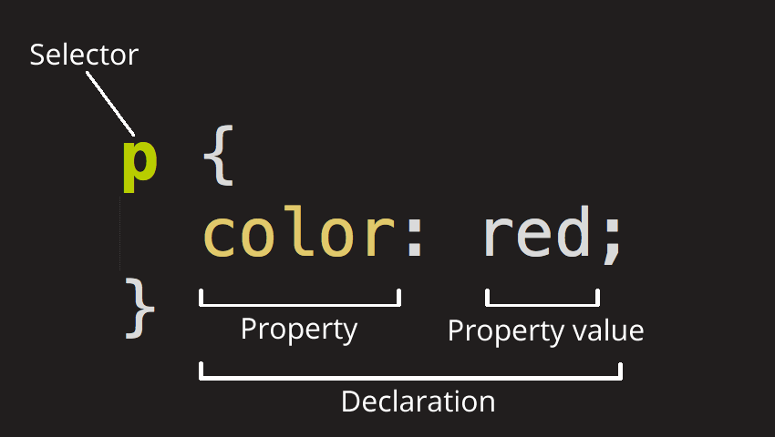

# CSS

CSS (Cascading Style Sheets) is the code used to style HTML elements.

## Rulesets

The following is the anatomy of a *ruleset*:




- **Selector**. This is the HTML element name at the start of the ruleset. It defines the element(s) to be styled (in this example, <p> elements). To style a different element, change the selector.
- **Declaration**. This is a single rule like color: red;. It specifies which of the properties of the elements you want to style.
- **Properties**. These are ways in which you can style an HTML element. (In this example, color is a property of the <p> elements.) In CSS, you choose which properties you want to affect in the rule.
- **Property value**. To the right of the property—after the colon—there is the property value. This chooses one out of many possible appearances for a given property. (For example, there are many color values in addition to red.)

## Selector types

|Selector name|Subject of the selector|Nomenclature|Example|
|-|-|-|-|
|Element, type or tag selector|Make a reference of all HTML elements of the specified type|`<tag>{}`|
|ID selector|Make a reference to the first element with the value of the specified `id` property|`#<ID name>{}`|
|Class selector|Make a reference to the first element with the value of the specified `id` property|`#<ID name>{}`|

```html
<h1 id="elemento">fdsa</h1>
<h2 id="elemento">fdsa</h1>

<h1 class="classelmenet">fdsa</h1>
<h2 class="classelmenet">fdsa</h1>


<button>No me cliquees >.<</button>
```
```
p { 

}

#elemento {
  color: blue;
}

.classelmenet {
  color: red;
}

img[src="./angelica.png"] {
  width: 50px;
}

button:hover {
  bacgkround-color: blue;
}
```

