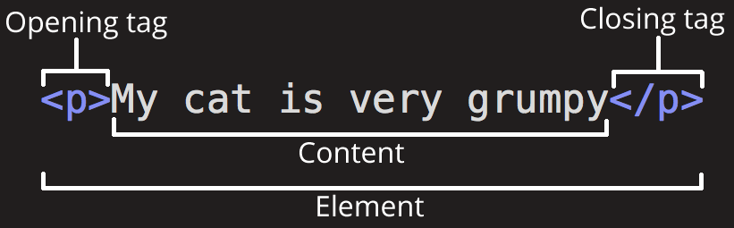

# HTML

HTML (Hypertext Markup Language) is a markup language used to make the code that structures the content of a web page. A web page using HTML consists of a series of elements that define the appearance and behavior of the content.

## Element

Elements are the building blocks of a web page using HTML. You can enclose or wrap certain content of your web page with HTML tags to appear or act in a certain way. 

The image below shows you the anatomy of an HTML element:



## Basic structure

```html
<!DOCTYPE html> 
<html>
  <head>
    <meta charset="utf-8">
    <title>My test page</title>
  </head>
  <body>
    <!--Here is the content of a web page -->
  </body>
</html>
```

- `<!DOCTYPE html` Indicates the HTML version (that indicates HTML 5)
- `<html>` is The root node of an HTML element.
- `<head>` allow to indicate useful meta data in the page.

## References

- [HTML Basics](https://developer.mozilla.org/en-US/docs/Learn/Getting_started_with_the_web/HTML_basics)